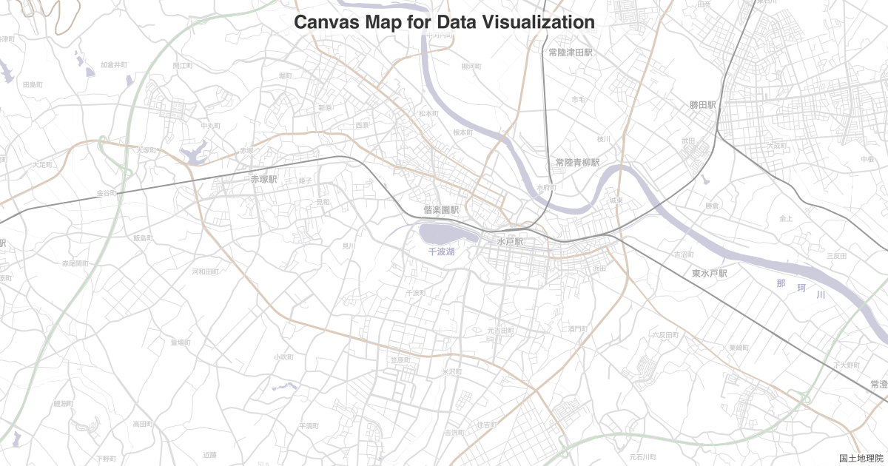

# Canvas Map for Data Visualization

Canvas マップ -データビジュアライゼーションのための

[](https://badge.fury.io/js/%40cieloazul310%2Fcanvasmap)



## How to Use

```typescript
const { CanvasMap } = require('@cieloazul310/canvasmap');

const width = 1000;
const height = 1000;
const map = new CanvasMap(width, height);
map.renderBasemap('vector')
  .then((map) => {
    map.exportPng('map.png');
  });
```

## Installing

```sh
yarn add @cieloazul310/canvasmap
```

## API Reference

### class CanvasMap

```typescript
const map = new CanvasMap(width, height, feature, options);
// or
const map = new CanvasMap(width, height, options);
```

#### constructor

##### width (required): `number`

生成する地図の横幅

##### height (required): `number`

生成する地図の縦幅

##### feature (*optional*): `GeoJSON` | `GeoJSON Feature`

地図の表示領域を地物、または GeoJSON オブジェクトで設定する

##### options (*optional*): object

- title?: `string`
- padding?: `Partial<{ top: number; right: number; bottom: number; left: number }`
- center?: `Position ([x, y])`
- zoom?: `number`

#### methods

##### getSize()

*return*: `object { width: number; height: number }`

##### getPadding()

*return*: `object { top: number; right: number; bottom: number; left: number }`

##### getCanvas()

*return*: `Canvas` ([node-canvas])

##### getContext()

*return*: `CanvasRenderingContext2D` ([node-canvas])

##### getProjection()

*return*: `GeoProjection` ([d3-geo])

##### getPath()

*return*: `GeoPath` ([d3-geo])

##### await renderBasemap(type: `'raster' | 'vector'`, options?)

*return*: `Promise<this>` (Promise object of CanvasMap class)

options:

- tileUrl: `string`;
- rasterGrayScale: `boolean`;
- background: `string`;
- backgroundFeature: `Feature<Polygon | MultiPolygon>`;
- attribution: `string`;

##### exportPng(fileName: `string`)

*return*: `this` (CanvasMap class)

##### exportJpg(fileName: `string`)

*return*: `this` (CanvasMap class)

##### addAttribution(attribution: `string`)

*return*: `this` (CanvasMap class)

##### getCanvasMapOptions()

*return*: `object CanvasMapOptions`

## Recipes

### Basic

```typescript
const width = 1000;
const height = 1000;
const map = new CanvasMap(width, height);
map.renderBasemap('vector')
  .then((map) => {
    map.exportPng('map.png');
  });
```

### Use async/await

```typescript
(async () => {
  const width = 1000;
  const height = 1000;
  const map = new CanvasMap(width, height);
  await map.renderBasemap('vector');
  map.exportPng('map.png');
})();
```

### Draw GeoJSON

```typescript
const geojson = JSON.parse(fs.readFileSync('gj.geojson', 'utf8'));
const width = 1000;
const height = 1000;
const map = new CanvasMap(width, height, geojson);
await map.renderBasemap('vector');
const context = map.getContext();
const path = map.getPath();
// draw features
geojson.features.forEach((feature) => {
  context.beginPath();
  path(feature);
  context.fillStyle = '#aaf';
  context.fill();
});
map.exportPng('map.png');
```

Browse [example codes](./examples) and [gallery](./gallery)

## References

- [node-canvas]
- [d3-geo]

[node-canvas]: https://github.com/Automattic/node-canvas
[d3-geo]: https://github.com/d3/d3-geo
